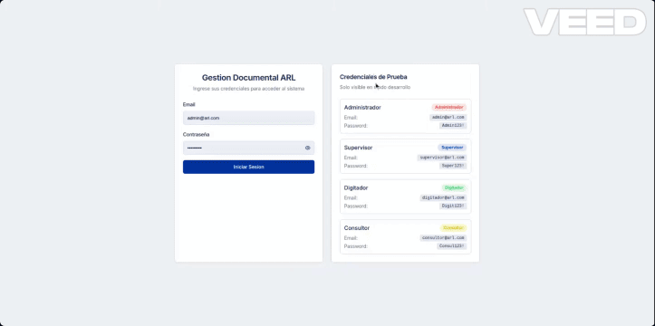

# Sistema de Gestión Documental ARL


Sistema integral de gestión documental diseñado para Administradoras de Riesgos Laborales (ARL) colombianas. Permite administrar documentos, empresas afiliadas, trabajadores y flujos de trabajo con un completo sistema de permisos basado en roles.

## Descripcion

El Sistema de Gestion Documental ARL es una aplicacion web moderna que facilita:

- **Gestion de documentos** con flujo de trabajo completo (borrador, revision, aprobacion)
- **Administracion de empresas** afiliadas a la ARL
- **Registro de trabajadores** asociados a cada empresa
- **Control de acceso** basado en roles (RBAC)
- **Auditoria completa** de todas las acciones del sistema
- **Dashboard analitico** con metricas en tiempo real
- **Funcionamiento offline** gracias a IndexedDB

## Demo



## Stack Tecnologico

### Frontend
| Tecnologia | Version | Descripcion |
|------------|---------|-------------|
| Next.js | 14.2 | Framework React con App Router |
| React | 18.2 | Biblioteca UI |
| TypeScript | 5.0 | Tipado estatico |
| Tailwind CSS | 3.4 | Framework CSS utilitario |

### UI Components
| Tecnologia | Descripcion |
|------------|-------------|
| Radix UI | Componentes accesibles y sin estilos |
| Lucide React | Iconos SVG |
| Recharts | Graficos y visualizaciones |
| Sonner | Notificaciones toast |
| React Hook Form | Manejo de formularios |
| Zod | Validacion de esquemas |

### Estado y Datos
| Tecnologia | Descripcion |
|------------|-------------|
| Zustand | Gestion de estado global |
| Dexie.js | Wrapper para IndexedDB |
| TanStack Table | Tablas con ordenamiento y paginacion |

### Testing
| Tecnologia | Descripcion |
|------------|-------------|
| Vitest | Test runner rapido |
| Testing Library | Testing de componentes React |
| Playwright | Tests E2E |
| MSW | Mocking de APIs |

## Caracteristicas Principales

### Gestion Documental
- Creacion, edicion y eliminacion de documentos
- Carga de archivos con validacion de tipos
- Estados de documento con flujo de trabajo
- Historial completo de cambios
- Alertas de vencimiento

### Sistema de Permisos RBAC
- 4 roles predefinidos con diferentes niveles de acceso
- Control granular por modulo y accion
- Proteccion de rutas automatica

### Dashboard Analitico
- Metricas de documentos por estado
- Distribucion por tipo y empresa
- Tendencias mensuales
- KPIs de desempeno

### Auditoria
- Registro de todas las acciones
- Filtrado por usuario, accion y fecha
- Exportacion de logs

### Notificaciones
- Sistema de alertas en tiempo real
- Notificaciones por vencimiento de documentos
- Centro de notificaciones integrado

### Soporte Offline
- Almacenamiento local con IndexedDB
- Persistencia de datos sin conexion
- Sincronizacion automatica

## Requisitos Previos

- **Node.js** 18.0 o superior
- **npm** 9.0+ o **yarn** 1.22+

## Instalacion

1. **Clonar el repositorio**
```bash
git clone https://github.com/tu-usuario/gestion-documental-arl.git
cd gestion-documental-arl
```

2. **Instalar dependencias**
```bash
npm install
# o
yarn install
```

3. **Configurar variables de entorno**
```bash
cp .env.example .env.local
```

4. **Iniciar el servidor de desarrollo**
```bash
npm run dev
# o
yarn dev
```

5. **Abrir en el navegador**
```
http://localhost:3000
```

## Uso

### Credenciales de Demo

El sistema incluye usuarios predefinidos para pruebas:

| Rol | Email | Contrasena |
|-----|-------|------------|
| Administrador | admin@arl.com | Admin123! |
| Supervisor | supervisor@arl.com | Super123! |
| Digitador | digitador@arl.com | Digit123! |
| Consultor | consultor@arl.com | Consul123! |

### Flujo Basico

1. **Iniciar sesion** con las credenciales segun el rol deseado
2. **Dashboard**: visualizar metricas y alertas
3. **Documentos**: crear, editar y gestionar documentos
4. **Flujo de trabajo**: enviar a revision, aprobar o rechazar
5. **Empresas/Trabajadores**: administrar entidades relacionadas

## Estructura del Proyecto

```
gestion-documental-arl/
├── src/
│   ├── app/                    # App Router de Next.js
│   │   ├── (auth)/            # Rutas de autenticacion
│   │   │   └── login/
│   │   └── (dashboard)/       # Rutas protegidas
│   │       ├── auditoria/
│   │       ├── configuracion/
│   │       ├── documentos/
│   │       ├── empresas/
│   │       ├── trabajadores/
│   │       └── usuarios/
│   ├── components/
│   │   ├── charts/            # Componentes de graficos
│   │   ├── features/          # Componentes por funcionalidad
│   │   │   ├── auth/
│   │   │   ├── dashboard/
│   │   │   └── documents/
│   │   ├── layout/            # Header, Sidebar, etc.
│   │   ├── shared/            # Componentes compartidos
│   │   └── ui/                # Componentes base (shadcn/ui)
│   ├── data/                  # Datos estaticos y semillas
│   ├── hooks/                 # Custom hooks
│   ├── lib/                   # Utilidades y servicios
│   │   ├── services/          # Logica de negocio
│   │   ├── utils/             # Funciones auxiliares
│   │   └── validations/       # Esquemas de validacion
│   ├── stores/                # Estado global (Zustand)
│   ├── types/                 # Definiciones TypeScript
│   └── __tests__/             # Tests unitarios e integracion
├── public/                    # Archivos estaticos
├── .env.example              # Variables de entorno ejemplo
├── next.config.js            # Configuracion Next.js
├── tailwind.config.js        # Configuracion Tailwind
├── tsconfig.json             # Configuracion TypeScript
└── vitest.config.ts          # Configuracion Vitest
```

## Roles y Permisos

| Modulo | Admin | Supervisor | Digitador | Consultor |
|--------|-------|------------|-----------|-----------|
| Dashboard | Ver | Ver | Ver | Ver |
| Documentos | CRUD + Eliminar | Ver + Aprobar | Crear, Ver, Editar | Solo Ver |
| Empresas | CRUD completo | Solo Ver | Solo Ver | Solo Ver |
| Trabajadores | CRUD completo | Solo Ver | Solo Ver | Solo Ver |
| Usuarios | CRUD completo | Sin acceso | Sin acceso | Sin acceso |
| Auditoria | Ver | Ver | Sin acceso | Sin acceso |
| Configuracion | Completo | Solo propias | Solo propias | Solo propias |

## Scripts Disponibles

```bash
# Desarrollo
npm run dev          # Inicia servidor de desarrollo

# Produccion
npm run build        # Genera build de produccion
npm run start        # Inicia servidor de produccion

# Calidad de codigo
npm run lint         # Ejecuta ESLint

# Testing
npm run test         # Ejecuta tests una vez
npm run test:watch   # Ejecuta tests en modo watch
npm run test:coverage # Genera reporte de cobertura
npm run test:ui      # Abre interfaz visual de Vitest
```

## Testing

### Ejecutar Tests

```bash
# Todos los tests
npm run test

# Tests con cobertura
npm run test:coverage

# Tests en modo watch (desarrollo)
npm run test:watch

# Interfaz visual de tests
npm run test:ui
```

### Cobertura

El proyecto mantiene umbrales minimos de cobertura:

- **Statements**: 80%
- **Branches**: 80%
- **Functions**: 80%
- **Lines**: 80%

### Tipos de Tests

- **Unitarios**: Componentes, hooks, utilidades
- **Integracion**: Flujos de autenticacion, busqueda global
- **E2E**: Playwright para flujos completos (en desarrollo)

## Contribucion

1. Fork del repositorio
2. Crear rama feature (`git checkout -b feature/nueva-funcionalidad`)
3. Commit de cambios (`git commit -m 'Agregar nueva funcionalidad'`)
4. Push a la rama (`git push origin feature/nueva-funcionalidad`)
5. Abrir Pull Request

### Guias de Estilo

- Seguir convenciones de ESLint configuradas
- Mantener cobertura de tests sobre 80%
- Documentar funciones y componentes complejos
- Usar commits descriptivos en espanol

## Licencia

Este proyecto esta bajo la Licencia MIT. Ver el archivo [LICENSE](LICENSE) para mas detalles.

---

Desarrollado con Next.js y React para la gestion documental de ARLs colombianas.
